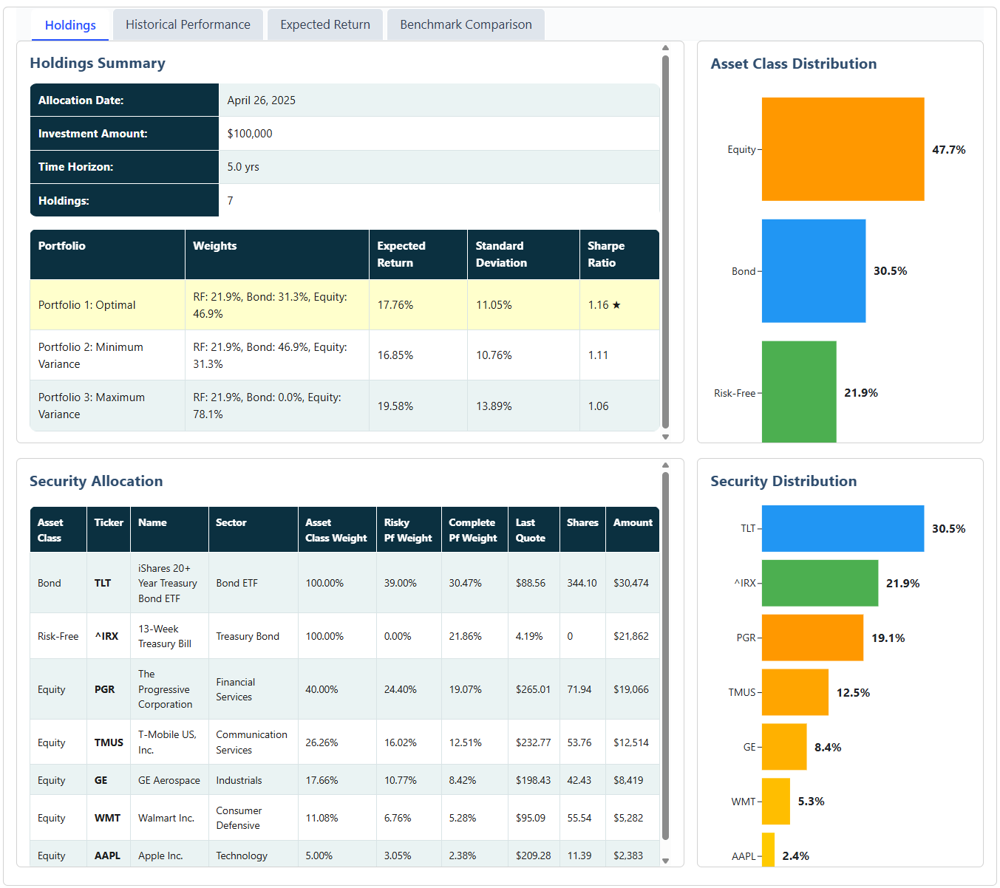
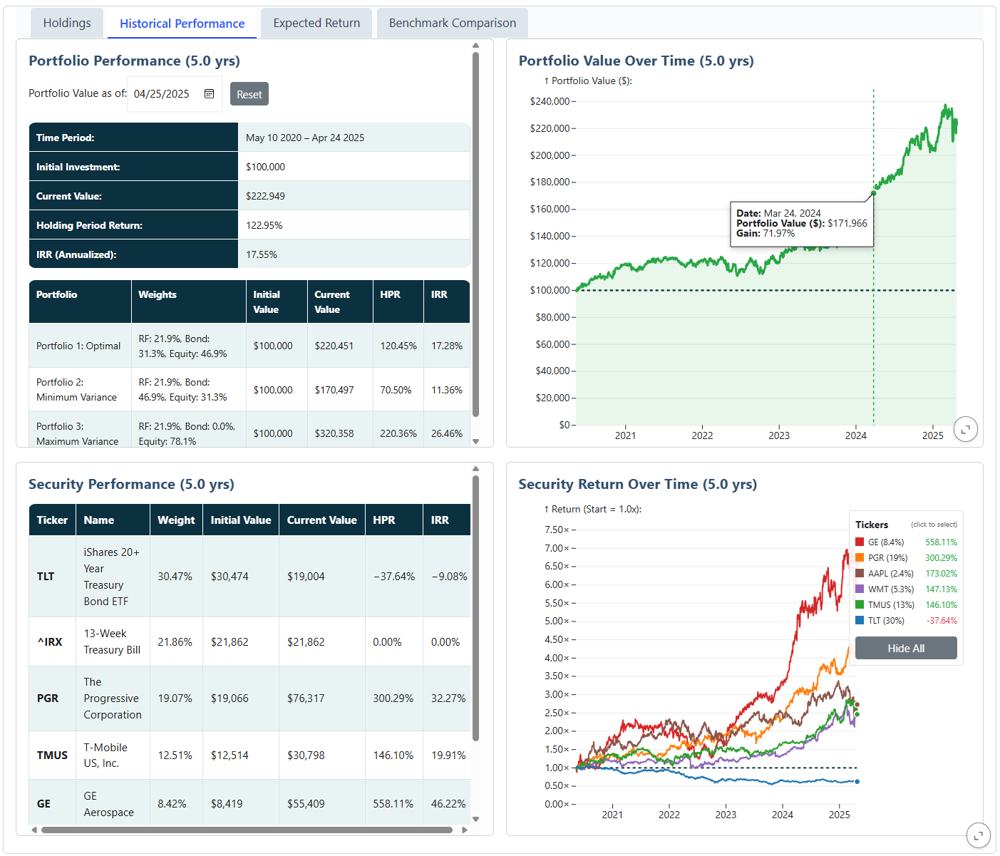
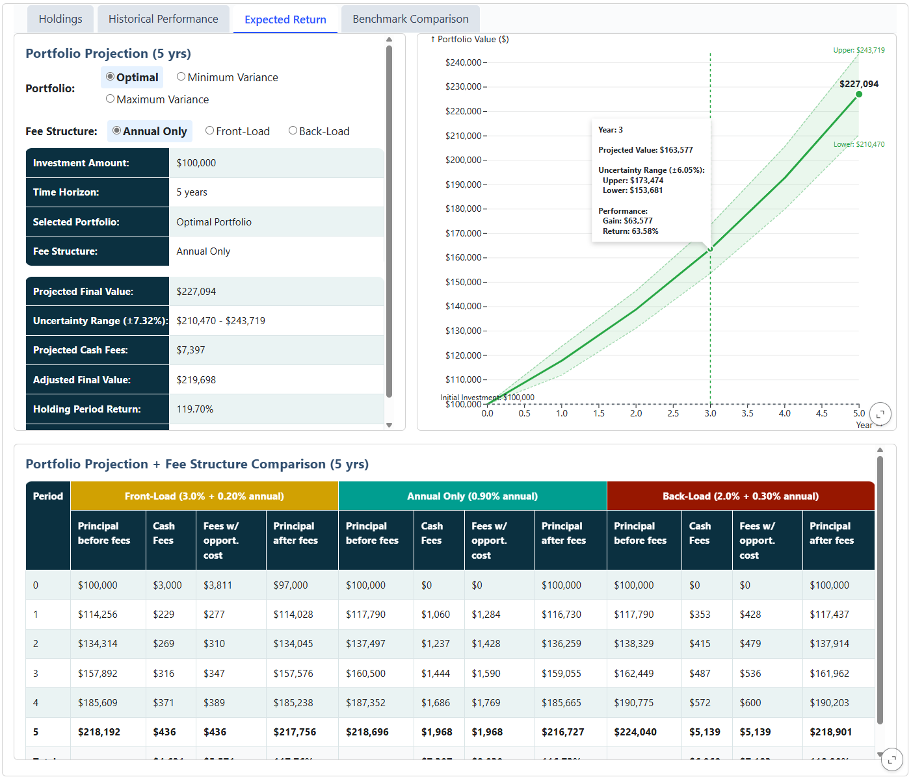
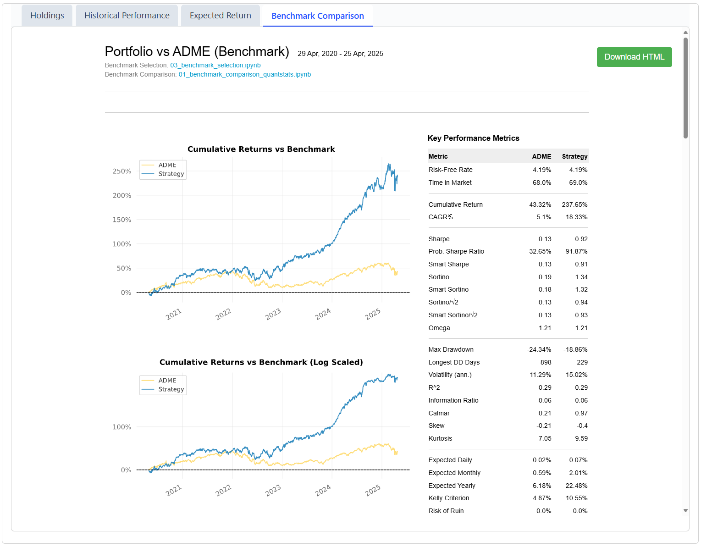

# Portfolio Construction Dashboard
Portfolio management blends art and science—choosing and weighting investments to achieve specific objectives while balancing risk and return. This dashboard showcases an end-to-end process used for building and managing portfolios to support a client with their investment decisions.

